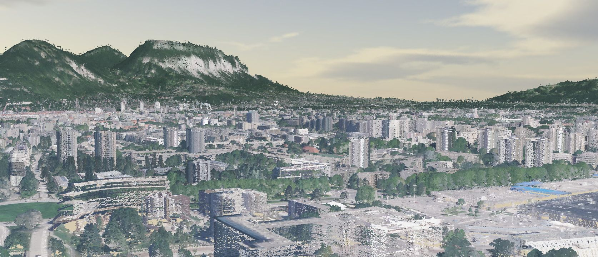

.. image:: https://img.shields.io/matrix/py3dtiles:matrix.org
    :target: https://matrix.to/#/#py3dtiles:matrix.org
    :alt: chat link

.. image:: https://img.shields.io/gitlab/pipeline/py3dtiles/py3dtiles/main
    :target: https://gitlab.com/py3dtiles/py3dtiles/-/pipelines
    :alt: Build pipeline status

.. image:: https://img.shields.io/pypi/v/py3dtiles
    :target: https://pypi.org/project/py3dtiles/
    :alt: Py3dtiles version on pypi

.. image:: https://img.shields.io/pypi/pyversions/py3dtiles.svg
    :target: https://pypi.org/project/py3dtiles/
    :alt: Supported python versions

.. image:: https://sonarcloud.io/api/project_badges/measure?project=py3dtiles_py3dtiles&metric=coverage
    :target: https://sonarcloud.io/summary/new_code?id=py3dtiles_py3dtiles
    :alt: Code coverage py3dtiles

.. image:: https://img.shields.io/gitlab/last-commit/py3dtiles/py3dtiles?gitlab_url=https%3A%2F%2Fgitlab.com
    :alt: GitLab last commit

.. image:: https://img.shields.io/gitlab/license/py3dtiles/py3dtiles
    :alt: Py3dtiles license

Py3dtiles
#########

Py3dtiles is a CLI tool and a library writing with Python for creating and manipulating `3D Tiles <https://docs.ogc.org/cs/22-025r4/22-025r4.html>`_.

Features
#########

Tileset manipulation
====================

* Read tileset lazily (to avoid useless memory consumption)
* Write tilesets with their tile contents
* Browse the tile structure, access to the properties and tile content with the ability to modify them
* Read and write pnts and b3dm with the batch table support

Tiling tools
============

All tiling tools are **available with the API and the CLI**

* Convert data into 3d tiles (tileset.json + pnts/b3dm files). The supported file formats are:
    * las/laz
    * xyz
    * ply
    * wkb
* Merge 3D Tiles tilesets into one tileset
* Read pnts and b3dm files and print a summary of their contents

Installation
############

With pip
========

To install Py3dtiles with pip (recommended method)

.. code-block:: bash

    pip install py3dtiles

For installing specific format dependencies (las/laz, ply, postgis, install from source...), please read the installation section in the `documentation <https://py3dtiles.org/>`_.

With docker
===========

At the moment we only publish on gitlab registry.

.. code-block:: bash

    docker run -it --rm \
        --mount type=bind,source="$(pwd)",target=/app/data/ \
        --volume /etc/passwd:/etc/passwd:ro --volume /etc/group:/etc/group:ro --user $(id -u):$(id -g) \
        registry.gitlab.com/py3dtiles/py3dtiles:<version> \
        convert <file>

NOTE:

- the `--mount` option is necessary for docker to read your source data and to write the result. The way it is written in this example only allows you to read source files in the current folder or in a subfolder
- This line `--volume /etc/passwd:/etc/passwd:ro --volume /etc/group:/etc/group:ro --user $(id -u):$(id -g)` is only necessary if your uid is different from 1000.

API basic example
#################

.. code-block:: python

    >>> from pathlib import Path
    >>>
    >>> from py3dtiles.tileset.tileset import TileSet
    >>>
    >>> tileset = TileSet.from_file(Path("tests/fixtures/tiles/tileset.json"))
    >>> all_tiles = (tileset.root_tile, *tileset.root_tile.get_all_children())
    >>> for tile in all_tiles:
    ...     if not tile.has_content():
    ...         continue
    ...     tile_content = tile.get_or_fetch_content(tileset.root_uri)
    ...     print(f"The tile {tile.content_uri} has a content of {type(tile_content)} type")
    ...     print(f"with this bounding volume: {tile.bounding_volume.to_dict()}")
    The tile r.pnts has a content of <class 'py3dtiles.tileset.content.pnts.Pnts'> type
    with this bounding volume: {'box': [0.390625, 0.3125, 0.0, 0.390625, 0.0, 0.0, 0.0, 0.3125, 0.0, 0.0, 0.0, 0.0]}
    The tile r1.pnts has a...

Result example
##############

The data visualized on this website is generated with the ``convert`` and ``merge`` CLI command of Py3dtiles: https://giro3d.org/examples/lidar_hd.html

The library used on this site is `giro3d <https://giro3d.org/index.html>`_ but there are other 3dtiles viewers.

Documentation
#############

The CLI and API documentation with examples are available here:

- main: https://py3dtiles.org/main
- last stable: https://py3dtiles.org/

Roadmap
#######

The objectives are:

- to support the standard at version 1.1 (mainly gltf as content)
- to convert more file formats
- to have a better tiler for geometries

Contributing
############

We welcome new contributions. This may be fixing an issue or adding a feature, but also:

- reporting an issue
- reviewing a MR
- improving the documentation or creating a tutorial
- talking about this project to others
- help others on the [chat room](https://matrix.to/#/#py3dtiles:matrix.org)

We have written a `contributing guide <CONTRIBUTING.md>`_ to help you for your first contribution.

License
#######

Py3dtiles is distributed under the Apache 2 Licence.

Thanks
######

The following entities have funded py3dtiles:

- [Oslandia](https://oslandia.com/)
- [Liris](https://liris.cnrs.fr/)
